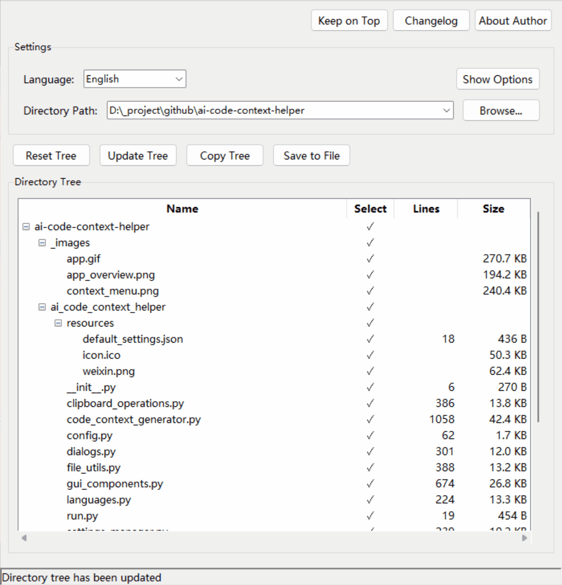

<p align="center">English | <a href="README_zh.md">中文</a><p>

## 📝 Introduction

AI Code Context Helper is designed for anyone who needs to understand, learn, and develop code. Through visualized project structure display and one-click code export, whether you're a programming beginner, professional developer, or educator, whether you're learning to understand code, developing new features, or seeking code improvement suggestions, it helps you easily extract code context and communicate efficiently with AI assistants.

<p align="center">
  
</p>

## 🎯 Main Application Scenarios

This tool allows you to easily transfer code content to AI assistants for the following scenarios:

- **Code Learning**: Understand complex project structures and operating principles, improving learning efficiency
- **Development Assistance**: Get more accurate code modification and feature implementation suggestions
- **Code Review**: Perform automated quality checks and performance optimization analysis
- **Refactoring Guidance**: Get code improvement suggestions based on complete context
- **Problem Diagnosis**: Help AI locate issues more accurately by providing the complete environment

> The software runs locally, doesn't require internet connection, and won't upload any code, ensuring your code privacy. You're free to choose which AI service to use, maintaining complete control over code sharing.

## 💡 Core Usage Scenarios

### 1. Code Learning and Analysis

1. **Select Target Project Directory**: Open the project you want to analyze
2. **Copy Complete Project Structure**: Use the "Copy Directory Tree" function to help AI understand the overall architecture
3. **Provide Core Code Files**: Select key files, use "Copy Path and Code" to provide all code at once
4. **Ask AI for Analysis**: Request AI to analyze the code structure, explain how it works, or provide a learning path

### 2. Code Modification and Development

1. **Locate Modules to Modify**: Find related files through the visual tree structure
2. **Export Related Code Context**: Select multiple related files simultaneously (e.g., models, controllers, and views)
3. **Describe Modification Requirements**: Clearly describe to AI the functionality you want to implement or the problem to fix
4. **Get Complete Implementation Solution**: AI will provide accurate code modification suggestions based on the complete context

## ✨ Main Features

### Intelligent File Management

- **Directory Tree Visualization**: Tree view displays project file structure
- **File Statistics**: Automatically shows file line count and size, making it easy to assess code volume
- **File Type Recognition**: Automatically detects text file encoding, distinguishes between text and binary files
- **Advanced Filtering**: Supports regular expression filtering, .gitignore rules application, and directory depth limits for handling large projects

### Flexible Selection and Export

- **Multi-selection Support**: Select individual files, multiple files, or entire directories and their subdirectories
- **Mouse Selection Mode**: Select/deselect multiple files at once by dragging the mouse
- **Batch Export**: Support exporting paths, code, or both for selected content
- **Context Menu**: Provides various copy options suitable for different development scenarios
- **Copy Content Statistics**: Status bar displays the number of files and total lines involved in the operation

### Integration and Convenience

- **System Tray Integration**: Minimize to system tray, always available without occupying desktop space
- **Global Hotkey**: Press Ctrl+2 hotkey in any application to show/hide the application window
- **Keep on Top Option**: Keep the window above other applications for easier operation
- **File System Integration**: Open folders in explorer or launch command line terminals directly from the context menu
- **Auto-save Mechanism**: Automatically saves settings every 30 seconds to prevent configuration loss

### Customization and Ease of Use

- **Multi-language Support**: Supports switching between Chinese and English
- **Output Format Customization**: Configure code and path prefix/suffix formats
- **Advanced Options Toggle**: Hide/show advanced settings to maximize directory tree display space
- **Lightweight Implementation**: Low resource usage, quick startup, seamless integration into existing development workflows

## 🔑 Keyboard Shortcuts

- **Ctrl+C**: Copy path and code of selected files
- **Ctrl+B**: Copy filename of selected files
- **Ctrl+F**: Open selected folder in file explorer
- **Ctrl+T**: Open command line terminal in selected folder
- **Ctrl+2**: Global hotkey to show/hide the application from anywhere
- **Tree State Persistence**: The application remembers the expanded state of each project directory between sessions

## 🔧 Installation and Usage

### Download and Install

1. Download the latest version from the [Releases page](https://github.com/sansan0/ai-code-context-helper/releases)
2. Extract the files to any location
3. Run `AI Code Context Helper.exe` to start the application

### How to Use

1. Click the "Browse..." button to select a project root directory
2. Check the files or folders you want to share in the directory tree
3. Right-click and select "Copy Path and Code" (or use other copy options)
4. Paste the copied content into an AI assistant (like ChatGPT, Claude, etc.) conversation
5. Ask questions or request code modification suggestions based on the provided code context

## 🛠️ Building from Source

### Requirements

- Python 3.9+
- Poetry package manager

### Install Dependencies

```bash
git clone https://github.com/sansan0/ai-code-context-helper.git
cd ai-code-context-helper
poetry install
```

### Build Executable

```bash
poetry run python -m cx_Freeze build
```

## 📄 License

This project is licensed under the GPL-3.0 License - see the [LICENSE](LICENSE) file for details
