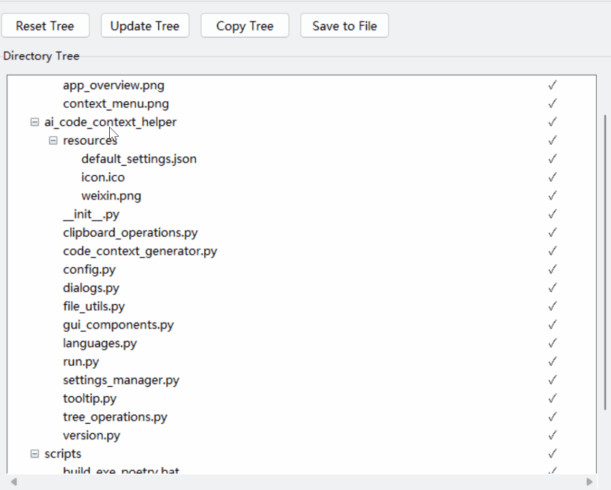

<p align="center">English | <a href="README_zh.md">中文</a><p>

## 📝 Introduction

AI Code Context Helper is a lightweight desktop application designed for developers collaborating with AI assistants. It provides a visual representation of project structures and enables quick, selective export of file paths and code content to the clipboard, streamlining code communication with ChatGPT, Claude, and other AI assistants.

<p align="center">
  
</p>

As a supplementary tool, it doesn't aim to replace existing editors or IDEs but focuses specifically on solving the code context transfer challenge in AI programming collaboration. Compared to integrated AI code editors, it offers advantages in simplicity, low learning curve, independence from specific AI services, and minimal resource usage, integrating seamlessly with various development environments.

<p align="center">
  
</p>

## ✨ Key Features

### Intelligent File Management

- **Directory Tree Visualization**: Display project file structure in tree view
- **File Type Recognition**: Automatically detect text file encodings and distinguish between text and binary files
- **Advanced Filtering**: Support for regex filtering, .gitignore rules, and directory depth limitation for handling large projects

### Flexible Selection and Export

- **Multi-selection Support**: Select individual files, multiple files, or entire directories with subdirectories
- **Mouse Selection Mode**: Drag to select/deselect multiple files at once
- **Batch Export**: Export paths, code, or both for selected content
- **Context Menu**: Multiple copy options for different development scenarios

### Integration and Accessibility

- **System Tray Integration**: Minimize to system tray to keep the tool readily available without cluttering your desktop
- **Global Hotkey**: Press Ctrl+2 anywhere to show/hide the application window
- **Always On Top Option**: Keep the window visible while working with other applications
- **File System Integration**: Open folders in Explorer or launch terminal directly from the context menu

### Customization and Ease of Use

- **Multilingual Support**: Switch between English and Chinese interfaces
- **Output Format Customization**: Configure prefix and suffix formats for code and paths
- **Advanced Settings Toggle**: Show/hide advanced options to maximize space for directory tree
- **Lightweight Implementation**: Low resource consumption, quick startup, seamlessly integrates with existing development workflows

## 🔑 Shortcuts and Special Features

- **Ctrl+C**: Copy path and code of selected files
- **Ctrl+B**: Copy filename of selected files
- **Ctrl+F**: Open selected folder in file explorer
- **Ctrl+T**: Open command line in selected folder
- **Ctrl+2**: Global hotkey to show/hide the application from anywhere
- **Tree State Preservation**: Application remembers the expanded state of each project directory between sessions

## 💡 Usage Tips

### Best Practice: Combining Project Structure with Code Content

For better AI comprehension of your project, follow these steps:

1. **First Share Project Structure**:

   - Select the root directory and use the "Copy Tree" function
   - Paste the directory tree to the AI to provide overall project architecture

2. **Then Share Key Files**:

   - Select relevant files based on your requirements (multiple files or directories)
   - Use "Copy Path and Code" to provide all necessary files at once

3. **Reference File Paths in Requirements**:
   - Example: "Please modify the `authenticate` method in `models/user.py` to add two-factor authentication"
   - Clear path references help AI locate relevant code accurately

### Module-Level Modifications

When modifying an entire functional module:

1. Select the module directory (e.g., `authentication/` folder)
2. Right-click and choose "Copy Path and Code" to include all files in the directory
3. Describe to the AI: "Please analyze this authentication module and suggest improvements"

> For codebases under 5,000 lines, you can copy all code directly to AI assistants like Claude or ChatGPT for code review and get complete modified code. This is essentially pair programming with AI - efficiency improves with your coding and requirements description skills.

## 📸 Screenshots

### Context Menu

<p align="center">
  
</p>

## 🔧 Installation and Usage

### Download and Install

1. Download the latest version from the [Releases page](https://github.com/sansan0/ai-code-context-helper/releases)
2. Extract the files to any location
3. Run `AI Code Context Helper.exe` to launch the application

### How to Use

1. Click "Browse..." to select your project root directory
2. Check the files or folders you want to share in the directory tree
3. Right-click and select "Copy Path and Code" (or other copy options)
4. Paste the copied content into your AI assistant (ChatGPT, Claude, etc.)
5. Ask questions or request code modifications based on the provided context

## ⚙️ Configuration Options

### Interface Options

- **Show Hidden Files**: Toggle display of hidden files and folders
- **Show Files/Show Folders**: Control what appears in the tree view
- **Use Relative Path**: Use paths relative to the root directory instead of absolute paths
- **Filter by .gitignore**: Apply rules from project's .gitignore file
- **Mouse Selection Mode**: Enable drag selection for easier batch operations
- **Max Depth**: Limit the display depth of the directory tree
- **File Filter**: Filter displayed files using regular expressions
- **Keep on Top**: Keep the window above all other applications
- **Advanced Options Toggle**: Hide/show advanced settings to maximize tree display space

## 🛠️ Building from Source

### Requirements

- Python 3.9+
- Poetry package manager

### Install Dependencies

```bash
git clone https://github.com/sansan0/ai-code-context-helper.git
cd ai-code-context-helper
poetry install
```

### Build Executable

```bash
poetry run python -m cx_Freeze build
```

## 📄 License

This project is licensed under the GPL-3.0 License - see the [LICENSE](LICENSE) file for details.
