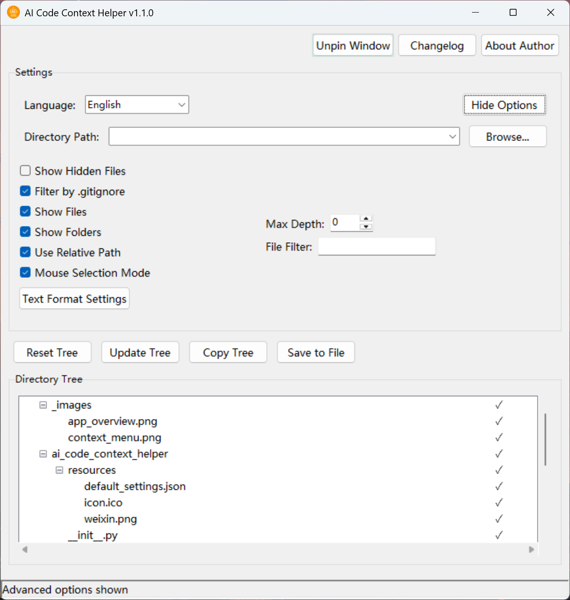
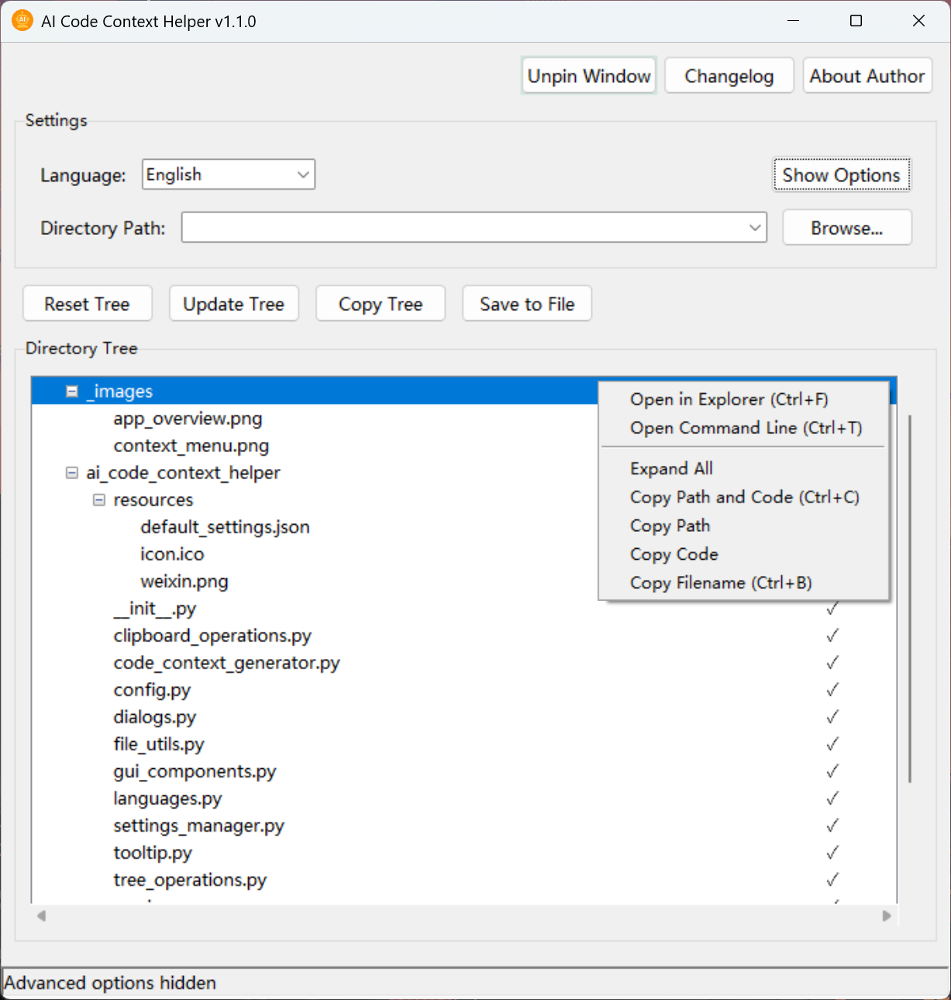

<p align="center"><a href="README.md">English</a> | 中文<p>

# AI Code Context Helper (AI 代码上下文助手)

## 📝 简介

AI Code Context Helper 是一款轻量级桌面应用，专为开发者与 AI 助手协作设计。它提供可视化的项目结构展示，支持快速选择性导出文件路径和代码内容到剪贴板，使与 ChatGPT、Claude 等 AI 助手的代码交流更加高效。

作为一个辅助工具，它不尝试替代现有编辑器或 IDE，而是专注于解决 AI 编程协作中的代码上下文传递问题。与集成式 AI 代码编辑器相比，它具有界面简洁、学习门槛低、不依赖特定 AI 服务、资源占用少等优势，可无缝融入各种开发环境。



<!-- 👆 主界面截图 -->

## ✨ 主要特性

### 智能文件管理

- **目录树可视化**：树形视图显示项目文件结构
- **文件类型识别**：自动检测文本文件编码，区分文本与二进制文件
- **筛选功能**：支持正则表达式过滤与目录深度限制，便于处理大型项目

### 灵活选择与导出

- **多选支持**：可选择单个文件、多个文件或整个目录及其子目录
- **批量导出**：支持导出选中内容的路径、代码或两者兼有
- **上下文菜单**：提供多种复制选项，适用于不同开发场景

### 定制化与易用性

- **多语言支持**：支持中英文切换
- **输出格式定制**：可配置代码和路径的前缀后缀格式
- **轻量实现**：低资源占用，启动迅速，无缝融入现有开发工作流

## 💡 使用技巧

### 最佳实践：结合目录结构与代码内容

为了让 AI 更全面地理解您的项目，建议采用以下步骤：

1. **先提供项目结构**：

   - 选择根目录并使用"复制目录树"功能
   - 将目录树粘贴给 AI，帮助它了解整体项目架构

2. **再提供关键文件代码**：

   - 根据需求选择相关的文件（可多选，多目录和多文件都行）
   - 使用"复制路径与代码"功能一次性提供所有必要文件

3. **描述需求时参考文件路径**：
   - 例如："请修改`models/user.py`中的`authenticate`方法，增加双因素认证支持"
   - 清晰的路径引用使 AI 能更准确定位需要关注的代码

### 模块级修改

当需要对某个功能模块进行整体修改时：

1. 选择该模块所在的目录（如`authentication/`文件夹）
2. 右键选择"复制路径与代码"，自动包含该目录下所有文件
3. 向 AI 描述："请分析这个认证模块的代码，并提出改进建议"

> 如果代码在 5000 行以内，你可以直接复制所有代码交给 claude 或者 chatgpt等ai,让它帮助审查代码质量，并让ai完整提供修改后的代码即可。本质上是你在与ai进行结对编程，如果你擅长代码和描述需求，那么效率就高，如果都不擅长，那么全是ai判断，容易出现误判。


## 📸 应用截图

### 目录树菜单



<!-- 👆 右键菜单操作截图 -->

## 🔧 安装与使用

### 下载安装

1. 从[Releases 页面](https://github.com/sansan0/ai-code-context-helper/releases)下载最新版本
2. 解压缩下载的文件到任意位置
3. 运行`AI Code Context Helper.exe`启动应用

### 使用方法

1. 点击"浏览..."按钮选择项目根目录
2. 在目录树中勾选需要分享的文件或文件夹
3. 右键点击选择"复制路径与代码"（或使用其他复制选项）
4. 将复制的内容粘贴到 AI 助手（如 ChatGPT、Claude 等）对话中
5. 根据复制的代码上下文，向 AI 提问或请求代码修改建议

## ⚙️ 配置选项

### 界面选项

- **显示隐藏文件**：是否显示隐藏文件和文件夹
- **显示文件/显示文件夹**：控制树视图中的显示内容
- **固定目录树**：重置时保留目录树的展开/收起状态
- **使用相对路径**：复制时使用相对路径而非绝对路径
- **最大深度**：限制目录树的显示深度
- **文件过滤**：使用正则表达式过滤显示的文件

## 🛠️ 从源码构建

### 环境要求

- Python 3.9+
- Poetry 包管理工具

### 安装依赖

```bash
git clone https://github.com/sansan0/ai-code-context-helper.git
cd ai-code-context-helper
poetry install
```

### 构建可执行文件

```bash
poetry run python -m cx_Freeze build
```

## 📄 许可证

本项目采用 GPL-3.0 许可证 - 详见 [LICENSE](LICENSE) 文件
