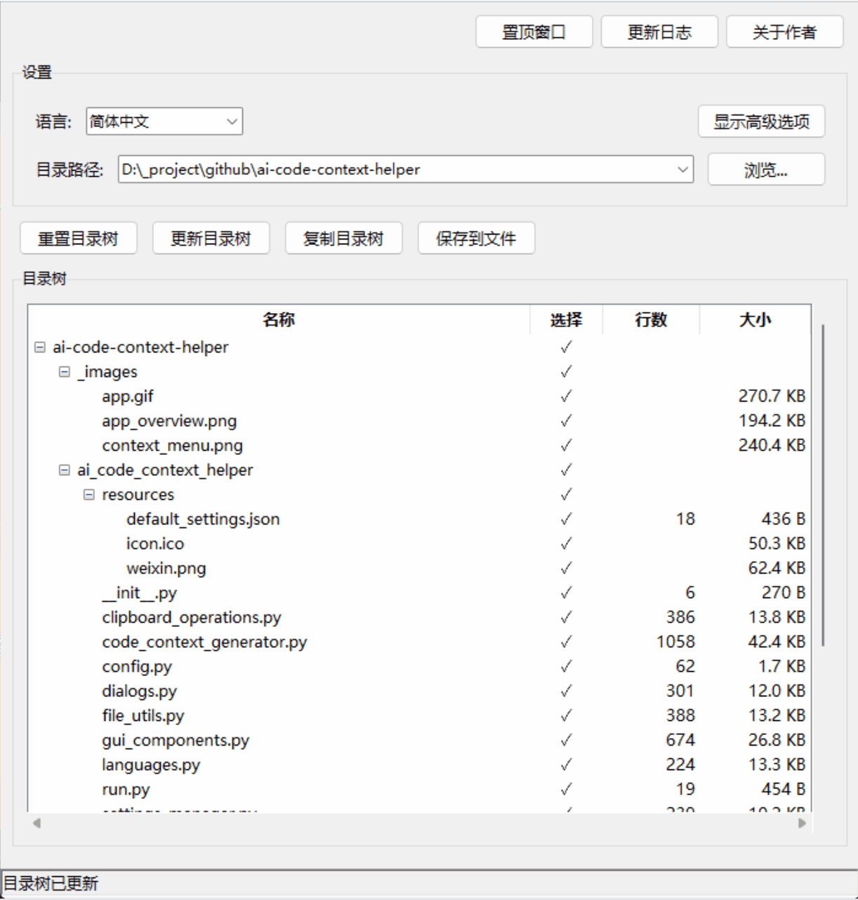

<p align="center"><a href="README.md">English</a> | 中文<p>

## 📝 简介

AI Code Context Helper 为所有需要理解、学习和开发代码的人设计。通过可视化的项目结构展示和一键代码导出功能，无论是编程初学者、职业开发者还是教育工作者，无论是学习理解代码、开发新功能，还是寻求代码改进建议，它都能帮助你轻松提取代码上下文，与 AI 助手高效交流。

<p align="center">
  
</p>

## 🎯 主要应用场景

本工具让你可以轻松将代码内容传递给 AI 助手，实现以下场景：

- **代码学习**: 理解复杂项目结构和工作原理，提高学习效率
- **开发辅助**: 获取更准确的代码修改和功能实现建议
- **代码审查**: 进行自动化质量检查和性能优化分析
- **重构指导**: 基于完整上下文的代码改进建议
- **问题诊断**: 通过提供完整环境帮助 AI 更准确地定位问题

> 软件在本地运行，不需要联网，不会上传任何代码，确保你的代码隐私安全。你可以自由选择使用哪种 AI 服务，完全由你控制代码分享范围

## 💡 核心使用场景

### 1. 代码学习与分析

1. **选择目标项目目录**：打开你想分析的项目
2. **复制完整项目结构**：使用"复制目录树"功能，让 AI 先了解整体架构
3. **提供核心代码文件**：选择关键文件，使用"复制路径与代码"一次性提供所有代码
4. **询问 AI 分析**：请求 AI 分析代码结构、解释工作原理或提供学习路径

### 2. 代码修改与开发

1. **定位需要修改的模块**：通过可视化树形结构找到相关文件
2. **导出相关代码上下文**：同时选择相关的多个文件（如模型、控制器和视图）
3. **描述修改需求**：向 AI 清晰描述你想实现的功能或修复的问题
4. **获取完整实现方案**：AI 会基于完整上下文提供准确的代码修改建议

## ✨ 主要特性

### 智能文件管理

- **目录树可视化**：树形视图显示项目文件结构
- **文件统计信息**：自动显示文件行数和大小，便于评估代码量
- **文件类型识别**：自动检测文本文件编码，区分文本与二进制文件
- **高级筛选**：支持正则表达式过滤、.gitignore 规则应用和目录深度限制，便于处理大型项目

### 灵活选择与导出

- **多选支持**：可选择单个文件、多个文件或整个目录及其子目录
- **鼠标框选模式**：通过拖动鼠标一次性选择/取消选择多个文件
- **批量导出**：支持导出选中内容的路径、代码或两者兼有
- **上下文菜单**：提供多种复制选项，适用于不同开发场景
- **复制内容统计**：状态栏显示操作涉及的文件数量和总行数

### 集成与便捷

- **系统托盘集成**：最小化到系统托盘，随时可用但不占用桌面空间
- **全局热键**：在任何应用中按下 Ctrl+2 快捷键即可显示/隐藏应用窗口
- **窗口置顶选项**：使窗口保持在其他应用之上，便于操作
- **文件系统集成**：直接从上下文菜单在资源管理器中打开文件夹或启动命令行终端
- **自动保存机制**：每 30 秒自动保存设置，防止配置丢失

### 定制化与易用性

- **多语言支持**：支持中英文切换
- **输出格式定制**：可配置代码和路径的前缀后缀格式
- **高级选项切换**：可隐藏/显示高级设置，最大化目录树显示空间
- **轻量实现**：低资源占用，启动迅速，无缝融入现有开发工作流

## 🔑 快捷键

- **Ctrl+C**：复制选中文件的路径和代码
- **Ctrl+B**：复制选中文件的文件名
- **Ctrl+F**：在资源管理器中打开选中文件夹
- **Ctrl+T**：在选中文件夹中打开命令行终端
- **Ctrl+2**：全局热键，从任何地方显示/隐藏应用程序
- **树状态保持**：应用程序会在会话之间记住每个项目目录的展开状态

## 🔧 安装与使用

### 下载安装

1. 从[Releases 页面](https://github.com/sansan0/ai-code-context-helper/releases)下载最新版本
2. 解压缩下载的文件到任意位置
3. 运行`AI Code Context Helper.exe`启动应用

### 使用方法

1. 点击"浏览..."按钮选择项目根目录
2. 在目录树中勾选需要分享的文件或文件夹
3. 右键点击选择"复制路径与代码"（或使用其他复制选项）
4. 将复制的内容粘贴到 AI 助手（如 ChatGPT、Claude 等）对话中
5. 根据复制的代码上下文，向 AI 提问或请求代码修改建议

## 🛠️ 从源码构建

### 环境要求

- Python 3.9+
- Poetry 包管理工具

### 安装依赖

```bash
git clone https://github.com/sansan0/ai-code-context-helper.git
cd ai-code-context-helper
poetry install
```

### 构建可执行文件

```bash
poetry run python -m cx_Freeze build
```

## 📄 许可证

本项目采用 GPL-3.0 许可证 - 详见 [LICENSE](LICENSE) 文件
